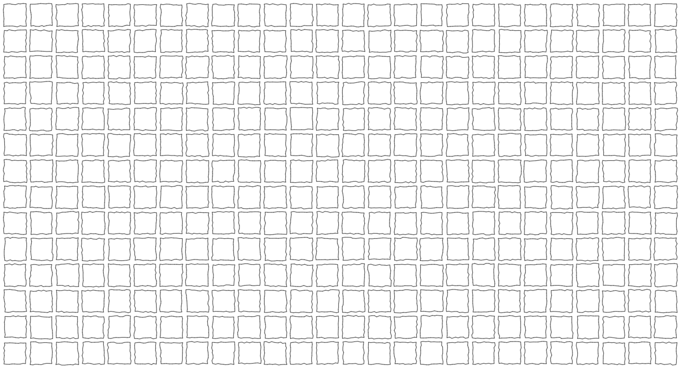
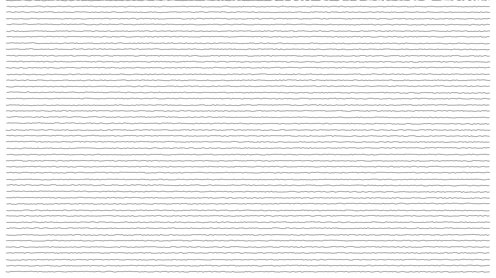
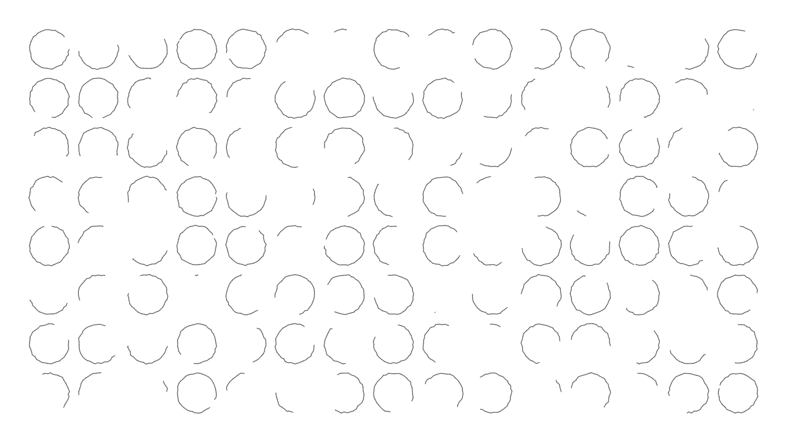
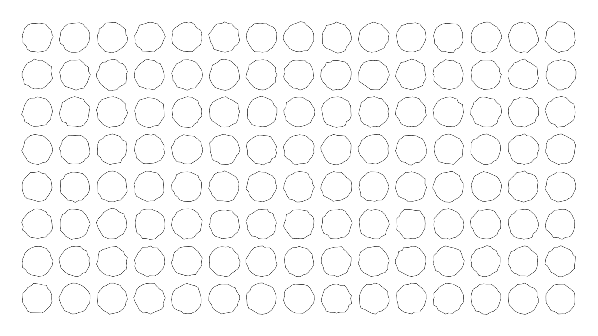
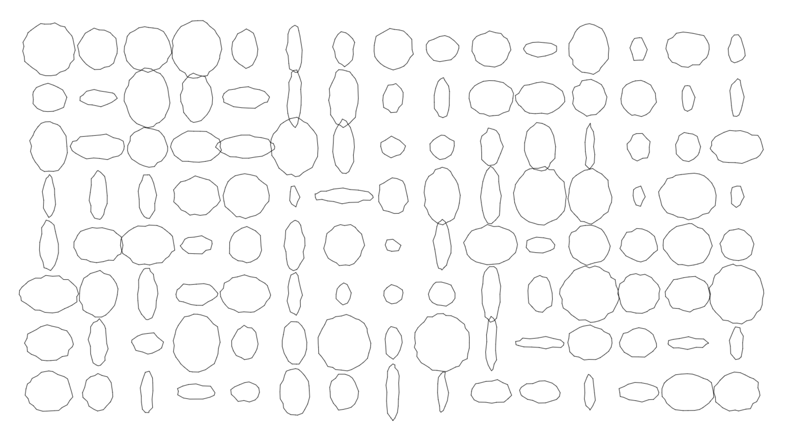
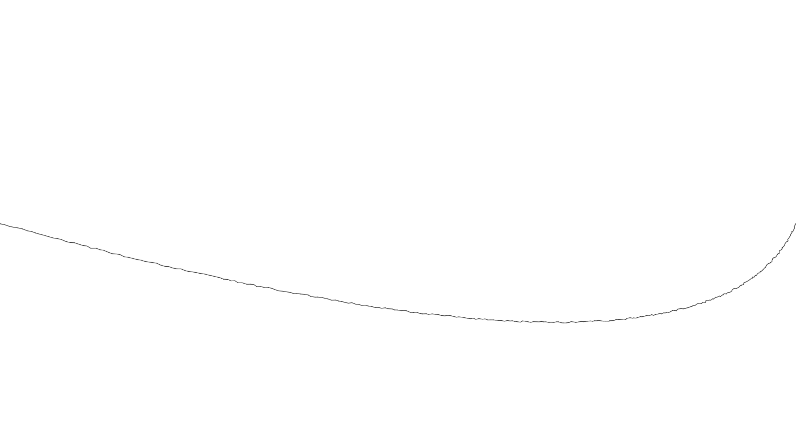
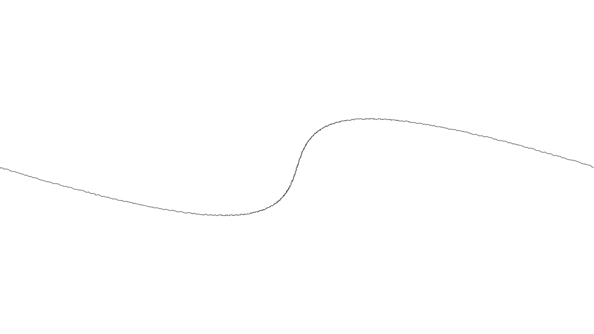
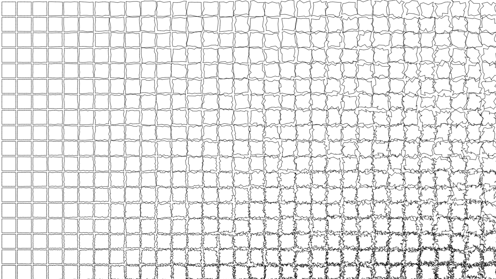

shaky
====

When talking about traditional drawing on paper, many people say, "I can't draw a straight line." But with traditional computer graphics, you can usually ONLY draw straight lines. Let's fix that.

shaky is a Canvas/Context2D wrapper that adds shaky drawing methods. Most of the drawing related methods of Context2D are proxied, either directly, or into shaky version. In addition, there are a few new useful shaky shape drawing methods.

### Methods:

	setSize(width, height) // sets the size of the canvas
	clear() // clears the canvas
	beginPath() // straight proxy
	stroke() // straight proxy
	fill() // straight proxy
	rect(x, y, w, h) // draws a shaky rectangle
	fillRect(x, y, w, h) // fills a shaky rectangle
	clearRect(x, y, w, h) // straight proxy
	strokeRect(x, y, w, h) // strokes a shaky rectangle
	moveTo(x, y) // moves to a point near the x, y point specified
	lineTo(x, y, exactEnd) // draws a shaky line to a point near x, y, or exactly to x, y if exactEnd is true.
	arc(x, y, r, start, end) // draws a shaky arc
	circle(x, y, r) // draws a shaky circle
	fillCircle(x, y, r) // fills a shaky circle
	strokeCircle(x, y, r) // strokes a shaky circle
	ellipse(x, y, xr, yr) // draws a shaky ellipse with a center of x, y, an x radius of xr and y radius of yr
	fillEllipse(x, y, xr, yr) // fills a shaky ellipse
	strokeEllipse(x, y, xr, yr) // strokes a shaky ellipse
	bezierCurveTo(x1, y1, x2, y2, x3, y3) // draws a shaky bezier curve
	quadraticCurveTo(x1, y1, x2, y2) // draws a shaky quadratic curve

Create a shaky instance using:

	shaky.create(canvas);

The canvas parameter can be a reference to a canvas object, or the string id of a canvas element on the page.

### Properties:

	width and height: read the current size of the canvas. use the setSize method to change these.
	canvas: a reference to the canvas that this shaky instance is wrapping.
	context: a reference to the context2d that this shaky instance is wrapping.
	segSize: controls the resolution of this shaky instance, described below.
	shake: the shakiness of this shaky instance, described below.

### segSize and shake:

segSize controls the resolution of the shaky instance. Say you use lineTo(x, y). Instead of drawing a single line from the current location to the new location, shaky will draw a series of short line segments between the two points. segSize specifies approximately how long those line segments will be. For example, if segSize = 10 and you draw a line from 0, 0, to 0, 100, it will draw 10 line segments, each approximately 10 pixels long. In reality, most will be longer, due to shake.

shake controls the random offset of each point or line segment. shake is a total range so if shake is 10 and you do a moveTo to 100, 100, you will actually wind up moving to somewhere from 95, 95 to 105, 105

Experiment changing both segSize and shake to create a lot of different shaky effects.

### Demo images

This shows the relationship of the segSize and shaky properties. Here, shaky increases left to right, and segSize decreases top to bottom.

